Applied Survival Models
================
Jacqueline Buros Novik
2016-06-25

Survival modeling is a core component of any clinical data analysis toolset.

Here we will work through an example of fitting a survival model in Stan, using as an example data from TCGA on patients with Bladder Urothelial Carcinoma.

Fitting survival models in Stan is fairly straightforward. However, specifying a model in Stan requires a bit more thought than when using standard MLE tools such as `survfit`.

This vignette is part 1 of a multi-part series.

Outline
=======

Over the course of several vignettes, we will review various models and approaches to analysis.

In this vignette, we cover the following:

1.  Data review & inspection
2.  Review parametric Weibull survival model
3.  Test parametric survival model against simulated data
4.  Fit NULL parametric survival model with TCGA data
5.  Check convergence & review posterior predictive checks on model

Part II of this series will consider a non-parametric piecewise exponential model.

Data
====

We will use data from [The Cancer Genome Atlas (TCGA)](https://tcga-data.nci.nih.gov) for patients diagnosed with Bladder Urothelial Carcinoma. This cohort has an acronym **BLCA**.

TCGA is a repository giving access to clinical and molecular data for a variety of cancer types, primarily focusing on genomic datasets and outcomes following standard therapeutic interventions. The BLCA cohort is described in this [this paper]().

The complete clinical & molecular data are available from TCGA data portals, but in this case we will use a curated version of these data available from <http://www.cbioportal.org/>.

To load the data into R, we *could* query these data via the web-url service:

``` r
url <- 'http://www.cbioportal.org/webservice.do?cmd=getClinicalData&case_set_id=blca_tcga_all'
req <- httr::GET(url)
clinical_data <- 
    httr::content(req,
                  type = 'text/tab-separated-values',
                  col_names = T,
                  col_types = NULL
                  )
str(clinical_data)
```

However, MSKCC has provided the [CGDS-R](http://cran.r-project.org/web/packages/cgdsr/index.html) package, which provides an easier interface to the same data.

Run the following lines of code to load the clinical data for this cohort:

``` r
mycgds = cgdsr::CGDS("http://www.cbioportal.org/public-portal/")
selected_case_list = 'blca_tcga_all'
clinical_data = cgdsr::getClinicalData(mycgds, selected_case_list)
```

Describe the structure of data available:

``` r
str(clinical_data,  no.list = T, vec.len = 2)
```

    ## 'data.frame':    413 obs. of  75 variables:
    ##  $ AGE                                       : int  77 73 67 84 78 ...
    ##  $ AJCC_METASTASIS_PATHOLOGIC_PM             : chr  "MX" "M0" ...
    ##  $ AJCC_NODES_PATHOLOGIC_PN                  : chr  "N0" "N0" ...
    ##  $ AJCC_PATHOLOGIC_TUMOR_STAGE               : chr  "Stage II" "Stage III" ...
    ##  $ AJCC_STAGING_EDITION                      : chr  "7th" "7th" ...
    ##  $ AJCC_TUMOR_PATHOLOGIC_PT                  : chr  "T2a" "T3" ...
    ##  $ ANGIOLYMPHATIC_INVASION                   : chr  "NO" "NO" ...
    ##  $ CLIN_T_STAGE                              : chr  "" "" ...
    ##  $ DAYS_TO_BIRTH                             : int  -28204 -27000 -24625 -30686 -28757 ...
    ##  $ DAYS_TO_COLLECTION                        : int  99 149 84 447 1157 ...
    ##  $ DAYS_TO_DEATH                             : int  NA NA NA 328 NA ...
    ##  $ DAYS_TO_INITIAL_PATHOLOGIC_DIAGNOSIS      : int  0 0 0 0 0 ...
    ##  $ DAYS_TO_LAST_FOLLOWUP                     : int  162 28 0 NA 1248 ...
    ##  $ DFS_MONTHS                                : num  19.05 0.92 ...
    ##  $ DFS_STATUS                                : chr  "DiseaseFree" "DiseaseFree" ...
    ##  $ ECOG_SCORE                                : chr  "" "1" ...
    ##  $ ETHNICITY                                 : chr  "NOT HISPANIC OR LATINO" "NOT HISPANIC OR LATINO" ...
    ##  $ FAMILY_HISTORY_CANCER_RELATIONSHIP        : chr  "" "" ...
    ##  $ FAMILY_HISTORY_CANCER_TYPE                : chr  "" "" ...
    ##  $ FORM_COMPLETION_DATE                      : chr  "2012-8-27" "2013-12-16" ...
    ##  $ GENDER                                    : chr  "MALE" "MALE" ...
    ##  $ HEIGHT                                    : num  180 173 170 188 NA ...
    ##  $ HISTOLOGICAL_SUBTYPE                      : chr  "Non-Papillary" "Papillary" ...
    ##  $ HISTORY_NEOADJUVANT_TRTYN                 : chr  "No" "No" ...
    ##  $ HISTORY_OTHER_MALIGNANCY                  : chr  "Yes" "Yes" ...
    ##  $ ICD_10                                    : chr  "C67.9" "C67.0" ...
    ##  $ ICD_O_3_HISTOLOGY                         : chr  "8120/3" "8120/3" ...
    ##  $ ICD_O_3_SITE                              : chr  "C67.9" "C67.0" ...
    ##  $ INFORMED_CONSENT_VERIFIED                 : chr  "YES" "YES" ...
    ##  $ INITIAL_PATHOLOGIC_DX_YEAR                : int  2012 2013 2012 2011 2009 ...
    ##  $ INITIAL_WEIGHT                            : int  500 1470 320 910 480 ...
    ##  $ IS_FFPE                                   : chr  "NO" "NO" ...
    ##  $ KARNOFSKY_PERFORMANCE_SCORE               : chr  "90" "80" ...
    ##  $ LYMPH_NODES_EXAMINED                      : chr  "YES" "YES" ...
    ##  $ LYMPH_NODES_EXAMINED_HE_COUNT             : int  0 0 NA 0 0 ...
    ##  $ LYMPH_NODE_EXAMINED_COUNT                 : int  19 14 NA 40 19 ...
    ##  $ METHOD_OF_INITIAL_SAMPLE_PROCUREMENT      : chr  "Transurethral resection (TURBT)" "Transurethral resection (TURBT)" ...
    ##  $ METHOD_OF_INITIAL_SAMPLE_PROCUREMENT_OTHER: chr  "" "" ...
    ##  $ NEW_TUMOR_EVENT_AFTER_INITIAL_TREATMENT   : chr  "NO" "NO" ...
    ##  $ NONINVASIVE_BLADDER_CA_TX_TYPE            : chr  "" "Transurethral resection alone" ...
    ##  $ NONINVASIVE_BLADDER_HISTORY               : chr  "YES" "YES" ...
    ##  $ OCCUPATION_CURRENT                        : chr  "" "Retired" ...
    ##  $ OCCUPATION_PRIMARY                        : chr  "" "" ...
    ##  $ OCCUPATION_PRIMARY_CHEMICAL_EXPOSURE      : chr  "Secondhand" "" ...
    ##  $ OCCUPATION_PRIMARY_INDUSTRY               : chr  "" "" ...
    ##  $ OCCUPATION_PRIMARY_YEARS_WORKED           : int  NA NA NA NA NA ...
    ##  $ OCT_EMBEDDED                              : chr  "true" "true" ...
    ##  $ OS_MONTHS                                 : num  19.05 0.92 ...
    ##  $ OS_STATUS                                 : chr  "LIVING" "LIVING" ...
    ##  $ OTHER_PATIENT_ID                          : chr  "10422FE9-8D70-40A9-9875-3FE9FAB68823" "6F30B069-C8F5-424C-9FB5-F7DBA508CB8B" ...
    ##  $ OTHER_SAMPLE_ID                           : chr  "FE3F7C73-8E04-48BA-AF35-E369F5C62E98" "784E85BB-9C4C-44B4-8BFC-3B2DBC1406C8" ...
    ##  $ PATHOLOGY_REPORT_FILE_NAME                : chr  "TCGA-GV-A40G.28754343-DA2B-4608-A66C-B4E41B52F6FF.pdf" "TCGA-E7-A7DU.BEB0E95C-EDF2-40A5-BB95-588D07369CEE.pdf" ...
    ##  $ PATHOLOGY_REPORT_UUID                     : chr  "28754343-DA2B-4608-A66C-B4E41B52F6FF" "BEB0E95C-EDF2-40A5-BB95-588D07369CEE" ...
    ##  $ PHARMACEUTICAL_TX_ADJUVANT                : chr  "NO" "[Unknown]" ...
    ##  $ PROSPECTIVE_COLLECTION                    : chr  "YES" "YES" ...
    ##  $ RACE                                      : chr  "WHITE" "WHITE" ...
    ##  $ RADIATION_TREATMENT_ADJUVANT              : chr  "NO" "NO" ...
    ##  $ RETROSPECTIVE_COLLECTION                  : chr  "NO" "NO" ...
    ##  $ SAMPLE_TYPE                               : chr  "Primary Tumor" "Primary Tumor" ...
    ##  $ SAMPLE_TYPE_ID                            : int  1 1 1 1 1 ...
    ##  $ SMOKING_PACK_YEARS                        : num  30 NA 30 40 20 ...
    ##  $ SMOKING_YEAR_STARTED                      : int  18 NA 37 NA NA ...
    ##  $ SMOKING_YEAR_STOPPED                      : int  1997 1980 2012 1992 1950 ...
    ##  $ TIME_TO_COMPLETE_RESPONSE                 : int  NA NA NA NA NA ...
    ##  $ TISSUE_SOURCE_SITE                        : chr  "GV" "E7" ...
    ##  $ TOBACCO_SMOKING_HISTORY_INDICATOR         : chr  "4" "3" ...
    ##  $ TREATMENT_OUTCOME_FIRST_COURSE            : chr  "Complete Remission/Response" "Complete Remission/Response" ...
    ##  $ TUMOR_STATUS                              : chr  "TUMOR FREE" "TUMOR FREE" ...
    ##  $ TX_90DAYS_PRIOR_TO_RESECTION              : chr  "" "" ...
    ##  $ TX_COMPLETE_RESPONSE                      : chr  "" "" ...
    ##  $ TX_INDUCTION_COURSES_INDICATOR            : chr  "" "" ...
    ##  $ TX_MAINTENANCE_COURSES_INDICATOR          : chr  "" "" ...
    ##  $ VIAL_NUMBER                               : chr  "A" "A" ...
    ##  $ VITAL_STATUS                              : chr  "Alive" "Alive" ...
    ##  $ WEIGHT                                    : num  82 110 52 80 NA ...

Data cleaning
-------------

Let's do some minimal data manipulation on this DataFrame to make it easier to work with. I personally happen to like lower-case variable names and to work with NA values instead of empty strings.

We will save the converted data in a data.frame called `clin_data`.

``` r
## names to lower case
names(clinical_data) <- tolower(names(clinical_data))

## convert empty strings -> NA values
convert_blank_to_na <- function(x) {
    if (!purrr::is_character(x)) {
        warning('input vector is not character - returning original input')
        return(x)
    } else {
        ifelse(x == '', NA, x)
    }
}
clin_data <- clinical_data %>%
    dplyr::mutate_each(funs = funs(convert_blank_to_na), everything())

## inspect resulting data frame
str(clin_data, vec.len = 2, list.len = 10)
```

    ## 'data.frame':    413 obs. of  75 variables:
    ##  $ age                                       : int  77 73 67 84 78 ...
    ##  $ ajcc_metastasis_pathologic_pm             : chr  "MX" "M0" ...
    ##  $ ajcc_nodes_pathologic_pn                  : chr  "N0" "N0" ...
    ##  $ ajcc_pathologic_tumor_stage               : chr  "Stage II" "Stage III" ...
    ##  $ ajcc_staging_edition                      : chr  "7th" "7th" ...
    ##  $ ajcc_tumor_pathologic_pt                  : chr  "T2a" "T3" ...
    ##  $ angiolymphatic_invasion                   : chr  "NO" "NO" ...
    ##  $ clin_t_stage                              : chr  NA NA ...
    ##  $ days_to_birth                             : int  -28204 -27000 -24625 -30686 -28757 ...
    ##  $ days_to_collection                        : int  99 149 84 447 1157 ...
    ##   [list output truncated]

Data exploration
----------------

In survival analysis, the outcome or dependent variable is the *time to event* where some event times are not observed (IE they are censored).

Here we consider the more common scenario of *right-censoring*. This is the case where the terminating event is not observed. Observations are instead censored at time `t` .

Our first analysis will treat **overall survival** as the event of interest, as opposed to progression-free survival. In this cohort, the overall survival is described by two variables: `os_status` & `os_months`.

We will start by inspecting these data.

### Negative/missing event times

We have one observation with missing data for `os_status`:

``` r
clinical_data %>%
    dplyr::filter(is.na(os_status) | os_status == '') %>%
    dplyr::select(os_status, os_months) %>%
    str()
```

    ## 'data.frame':    1 obs. of  2 variables:
    ##  $ os_status: chr ""
    ##  $ os_months: num NA

We have a 3 observations with unknown and/or negative survival times (`os_months < 0`):

``` r
clinical_data %>%
    dplyr::filter(!is.na(os_status) & os_status != '') %>%
    dplyr::filter(os_months < 0 | is.na(os_months)) %>%
    dplyr::select(os_status, os_months) %>%
    head()
```

    ##   os_status os_months
    ## 1  DECEASED        NA
    ## 2  DECEASED        NA
    ## 3    LIVING      -2.1

For now, we remove these observations from our analysis dataset (`clin_data`).

``` r
clin_data <- 
    clin_data %>%
    dplyr::filter(!is.na(os_status) & os_status != '') %>%
    dplyr::filter(os_months >= 0 & !is.na(os_months))

## confirm 4 fewer observations than original
assert_that(nrow(clin_data) == nrow(clinical_data) - 4)
```

    ## [1] TRUE

### Distribution of event times

Among the remaining observations, the median time to event is 17.61 months.

Event times are distributed as follows among observed (DECEASED) & censored (LIVING) observations:

``` r
ggplot(clin_data,
       aes(x = os_months,
           group = os_status,
           colour = os_status,
           fill = os_status
           )) + 
    geom_density(alpha = 0.5)
```

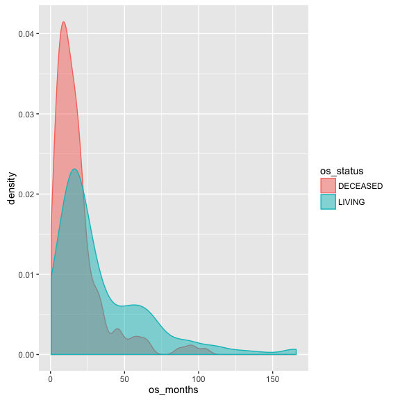

The KM curve for these observations additionally looks like this:

( constructed using `survfit` )

``` r
mle.surv <- 
    survfit(
        Surv(os_months,os_deceased) ~ 1,
        data = clin_data %>%
            dplyr::mutate(os_deceased = os_status == 'DECEASED')
    )
autoplot(mle.surv, conf.int = F) +
    ggtitle('KM survival curve for BLCA cohort')
```

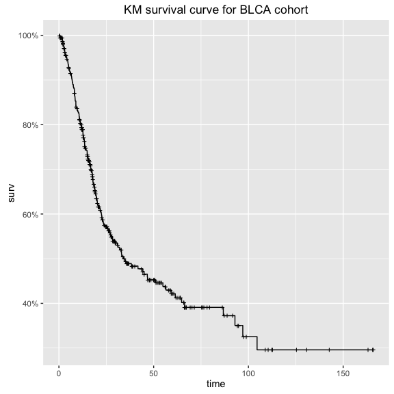

First analysis: parametric survival model
=========================================

For our first analysis we will work with a parametric Weibull survival model.

We will start with model code adapted from [wei\_bg.stan](https://github.com/to-mi/stan-survival-shrinkage/blob/master/wei_bg.stan) within the [github repo]('http://github.com/to-mi/stan-survival-shrinkage') accompanying [Peltola et al, 2014](http://ceur-ws.org/Vol-1218/bmaw2014_paper_8.pdf)'s nice paper describing a bayesian approach to biomarker evaluation.

This model assumes that the time to event `x` follows a Weibull distribution.

Stan parameterizes this probability density function as :

$$f(x|\\alpha,\\sigma) = 
\\frac{\\alpha}{\\sigma}\\left(\\frac{x}{\\sigma}\\right)^{\\alpha-1}e^{-(x/\\sigma)^{\\alpha}}$$

In the context of this analysis, we will define two parameters:

-   `alpha` (shape) defined as above
-   `mu` (scale) where $\\sigma = e^\\frac{-\\mu}{\\alpha}$.

If we had covariates and wanted to estimate a proportional hazards model, we would replace `mu` with a linear combination of covariates. However, in this case we are interested in recovering features of our NULL model and so we treat `mu` as a constant intercept.

Stan code for the model
-----------------------

The stan code for this model is included in this [biostan package](http://github.com/jburos/biostan) as `weibull_survival_null_model.stan`.

It can be accessed by calling `system.file()`, as:

``` r
if (!require(biostan))
    devtools::install_github('jburos/biostan')
library(biostan)
stan_file <- system.file('stan', 'weibull_survival_null_model.stan', package =  'biostan')
```

Here are the contents of this file:

``` r
biostan::print_stan_file(stan_file)
```

    ## /*  Variable naming: 
    ##  obs       = observed 
    ##  cen       = (right) censored 
    ##  N         = number of samples 
    ##  tau       = scale parameter 
    ## */ 
    ## data { 
    ##   int<lower=0> Nobs; 
    ##   int<lower=0> Ncen; 
    ##   vector[Nobs] yobs; 
    ##   vector[Ncen] ycen; 
    ## } 
    ##  
    ## transformed data { 
    ##   real<lower=0> tau_mu; 
    ##   real<lower=0> tau_al; 
    ##  
    ##   tau_mu <- 10.0; 
    ##   tau_al <- 10.0; 
    ## } 
    ##  
    ## parameters { 
    ##   real alpha_raw; 
    ##   real mu; 
    ## } 
    ##  
    ## transformed parameters { 
    ##   real alpha; 
    ##   alpha <- exp(tau_al * alpha_raw); 
    ## } 
    ##  
    ## model { 
    ##   yobs ~ weibull(alpha, exp(-(mu)/alpha)); 
    ##   increment_log_prob(weibull_ccdf_log(ycen, alpha, exp(-(mu)/alpha))); 
    ##  
    ##   alpha_raw ~ normal(0.0, 1.0); 
    ##   mu ~ normal(0.0, tau_mu); 
    ## } 
    ## 

### The model in detail

Before using this model for analysis, we want to first review the model code in detail & test it against some simulated data.

This will ensure that (a) we understand the model well, and (b) the model can recover estimates from simulated data.

*( As you will see, several parts of the simulate-data process can also be re-used for posterior predictive checking. So we will save components of the process to be reused in later steps. )*

If you're at an R console, you can open the Stan file in an editor as follows:

``` r
if (interactive())
    file.edit(stan_file)
```

#### Review data block

Let's review the data block first.

This will tell us the structure and format of data input to the model.

``` r
print_stan_file(stan_file, section = 'data')
```

    ## data { 
    ##   int<lower=0> Nobs; 
    ##   int<lower=0> Ncen; 
    ##   vector[Nobs] yobs; 
    ##   vector[Ncen] ycen; 
    ## }

The censored & observed data points are provided as separate input vectors.

*observed data points*

-   `Nobs`: number of observed data points
-   `yobs`: times to observed events

*censored data points*

-   `Ncen`: number of censored data points
-   `ycen`: times to censored events

Recall that this is a NULL model (with no covariate values), so the number & values of observed covariates are not needed.

#### Review model block

The stan code contains an implicit constant term, in the linear predictor `mu`.

``` r
print_stan_file(stan_file, section = 'model')
```

    ## model { 
    ##   yobs ~ weibull(alpha, exp(-(mu)/alpha)); 
    ##   increment_log_prob(weibull_ccdf_log(ycen, alpha, exp(-(mu)/alpha))); 
    ##  
    ##   alpha_raw ~ normal(0.0, 1.0); 
    ##   mu ~ normal(0.0, tau_mu); 
    ## }

Observe how the ccdf (complementary cumulative distribution function) is used to compute the log probability of the censored observations.

*What does the ccdf represent in this scenario?*

*How does the model address the censoring process?*

#### Review parameters block

Our stan code also contains a reparameterization of the `alpha` term, in the `transformed parameters` block.

Observe:

``` r
print_stan_file(stan_file, section = 'transformed parameters')
```

    ## transformed parameters { 
    ##   real alpha; 
    ##   alpha <- exp(tau_al * alpha_raw); 
    ## }

(recall that `tau_al` is a constant scaling term set to 10, and `alpha_raw` is a parameter with a normal(0, 1) prior distribution).

This reparameterization achieves two things :

1.  The use of `tau_al * alpha_raw` is an example of a **non-centered parameterization**.
    -   It would have been *mathematically* equivalent to define a (non-transformed) parameter `alpha` with a prior `normal(0, 10)`.
    -   However, this parameterization yields a parameter (`alpha_raw`) which is on a similar scale as other parameters in our model. The `exp()` transformation makes the difference between these two scales even more dramatic.
    -   In general, having all parameters on a similar scale makes the sampling more efficient.

2.  The `exp()` transformation of this parameter additionally allows us to put a prior on `log alpha`.
    -   we want to put a prior on `log alpha` since alpha enters into our likelihood in the exponent.

This seems like a lot of gymnastics to be doing.

However, it has practical implications for our modeling efficiency.

Observe that, for a single value of `alpha_raw` (e.g. 0.2), the transformation yields:

``` r
alpha_raw <- 0.2
tau_al <- 10
log_alpha <- alpha_raw * tau_al
alpha <- exp(log_alpha)
print(alpha)
```

    ## [1] 7.389056

which may seem silly.

**However**

Consider the resulting distribution of alpha over a range of values for `alpha_raw` sampled from our `normal(0, 1)` prior:

``` r
alpha_raw <- rnorm(1000, 0, 1)
tau_al <- 10
log_alpha <- alpha_raw * tau_al
alpha <- exp(log_alpha)
ggplot(data.frame(alpha = alpha, alpha_raw = alpha_raw), 
       aes(x = alpha)) + 
    geom_density() + 
    scale_x_log10(labels = scientific)
```

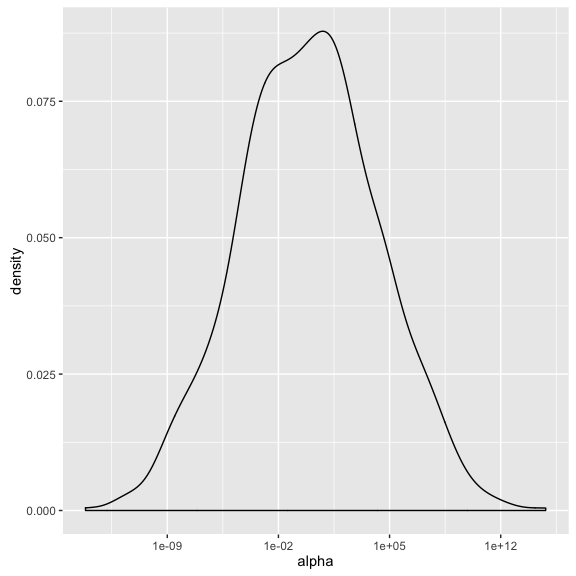

Notice how `alpha` ranges from 1e-10 to 1e+10 on a log scale. We have to truncate this dramatically to even consider plotting it on its original scale.

Sampling this parameter space may require different step sizes & different tuning parameter values throughout this distribution.

The `alpha_raw` scale, by comparison, is a lot friendlier.

``` r
ggplot(data.frame(alpha = alpha, alpha_raw = alpha_raw), 
       aes(x = alpha, y = alpha_raw)) + 
    geom_density2d() + 
    scale_x_log10(labels = scientific)
```

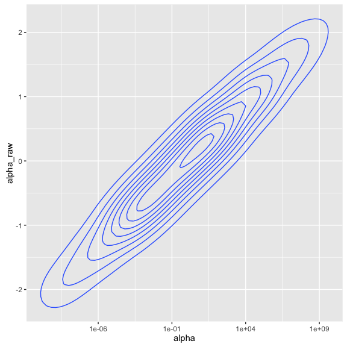

This distribution is centered at 0 and has more consistent behavior throughout its range of values.

What's important to note here is that while the non-centered parameterization is mathematically equivalent to the standard parameterization, it is (in some ways) a *different model*. Consider that the reparameterization will impact the posterior estimates of parameter values.

Packages like [rstanarm](http://github.com/stan-dev/rstanarm) which provide easy wrappers to a variety of standard models implemented in Stan use a non-centered parameterization by default.

More information on non-centered parameterization:

1.  [discussion on stan-dev list](https://groups.google.com/forum/#!topic/stan-dev/9ZvhKpXlwuI)
2.  [Gelman, 2004. Parameterization and Bayesian Modeling](http://www.stat.columbia.edu/~gelman/research/published/parameterization.pdf)

Testing the model on simulated data
-----------------------------------

Now that we have reviewed the model code, we are ready to simulate data according to this model.

We can simulate data using R or in Stan. We will start by simulating data in R.

### Simulate data in R

Like our stan model code, we originally based this function on that used by the [example.R](https://github.com/to-mi/stan-survival-shrinkage/blob/master/example.R) file from the [stan-survival-shrinkage github repo](https://github.com/to-mi/stan-survival-shrinkage).

However, after further inspection (see the related [weibull-survival-model](weibull-survival-model.html) vignette) we modified the simulate-data function slightly. Here we will work with the modified function.

Our `weibull_sim_data` function takes two parameters (`alpha` and `mu`) as inputs and a desired sample size (`n`). It returns a data frame of simulated event times.

``` r
weibull_sim_data <- function(alpha, mu, n) {
    
    data <- data.frame(surv_months = rweibull(n = n, alpha, exp(-(mu)/alpha)),
                       censor_months = rexp(n = n, rate = 1/100),
                       stringsAsFactors = F
                       ) %>%
        dplyr::mutate(os_status = ifelse(surv_months < censor_months,
                                          'DECEASED', 'LIVING'
                                          ),
                       os_months = ifelse(surv_months < censor_months,
                                          surv_months, censor_months
                                          )
                       )

    return(data)
}
```

A few comments about this function:

1.  Notice how the censoring process is `rexp()`. We chose this somewhat arbitrarily.
    -   In general, our Stan model is ignorant of the censoring process except to assume that censoring is noninformative.

2.  We have also deliberately written this function to mimic the structure of our clinical data.

This will make it easier to reuse this & other functions later.

#### Simulate data for arbitrary input values

We can use this function to simulate a dataset for hypothetical parameter values of `alpha` & `mu`.

``` r
test_alpha <- 0.8
test_mu <- -3

## sample size from TCGA blca data
test_n <- nrow(clin_data)

## test these inputs for arbitrary values of alpha & mu
simulated_data <- 
    weibull_sim_data(alpha = test_alpha,
                 mu = test_mu,
                 n = test_n
                 ) 
head(simulated_data)
```

    ##   surv_months censor_months os_status  os_months
    ## 1   1.8731055      59.78007  DECEASED  1.8731055
    ## 2   4.3793445      29.48772  DECEASED  4.3793445
    ## 3  23.2417809     154.68420  DECEASED 23.2417809
    ## 4   0.5908705     110.84071  DECEASED  0.5908705
    ## 5  10.3814574     283.64889  DECEASED 10.3814574
    ## 6   3.2324781     175.14263  DECEASED  3.2324781

The simulated survival curve looks like:

``` r
## plot KM curve from simulated data
simulated_data <- 
    simulated_data %>%
    dplyr::mutate(os_deceased = os_status == 'DECEASED')

autoplot(survival::survfit(Surv(os_months, os_deceased) ~ 1,
                      data = simulated_data
                      ), conf.int = F) + 
    ggtitle('Simulated KM curve')
```

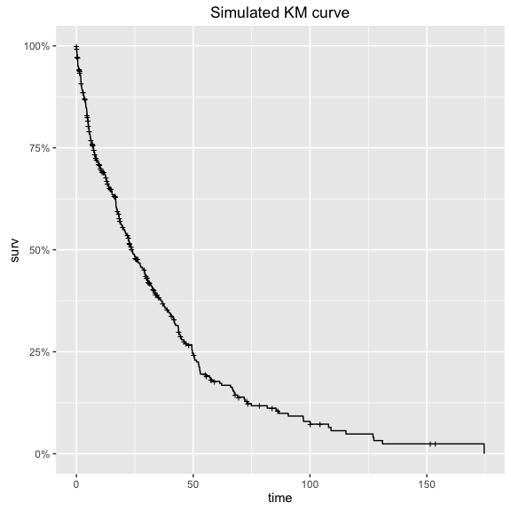

### fit to simulated data in stan

Now that we have simulated data, we are ready to fit the model in Stan.

If we have written both our stan code & simulated data process correctly, our posterior intervals for `alpha` and `mu` should contain the values used to simulate our dataset (0.8 and -3).

#### preparing data for stan

Stan takes data input as a list. The contents of the list should match those of the `data` block in the stan code.

E.g. looking at the data block -

``` r
print_stan_file(stan_file, section = 'data')
```

    ## data { 
    ##   int<lower=0> Nobs; 
    ##   int<lower=0> Ncen; 
    ##   vector[Nobs] yobs; 
    ##   vector[Ncen] ycen; 
    ## }

our input list to Stan should contain dimensions & values for observed & censored data, separately.

``` r
observed_data <- simulated_data %>%
    dplyr::filter(os_status == 'DECEASED')

censored_data <- simulated_data %>%
    dplyr::filter(os_status != 'DECEASED')

stan_data <- list(
    Nobs = nrow(observed_data),
    Ncen = nrow(censored_data),
    yobs = observed_data$os_months,
    ycen = censored_data$os_months
)
rm(censored_data)
rm(observed_data)
str(stan_data)
```

    ## List of 4
    ##  $ Nobs: int 299
    ##  $ Ncen: int 110
    ##  $ yobs: num [1:299] 1.873 4.379 23.242 0.591 10.381 ...
    ##  $ ycen: num [1:110] 32.9 34.5 18.7 11.6 86.2 ...

(wrap this prep-data process in a function `gen_stan_data` for later)

``` r
gen_stan_data <- function(data) {
    observed_data <- data %>%
        dplyr::filter(os_status == 'DECEASED')
    
    censored_data <- data %>%
        dplyr::filter(os_status != 'DECEASED')
    
    stan_data <- list(
        Nobs = nrow(observed_data),
        Ncen = nrow(censored_data),
        yobs = observed_data$os_months,
        ycen = censored_data$os_months
    )
}
```

#### test simulated values with stan

Let's call `stan`:

``` r
recover_simulated <- 
    rstan::stan(stan_file,
                data = gen_stan_data(simulated_data),
                chains = 4,
                iter = 1000,
                seed = 1328025050
                )
print(recover_simulated)
```

    ## Inference for Stan model: weibull_survival_null_model.
    ## 4 chains, each with iter=1000; warmup=500; thin=1; 
    ## post-warmup draws per chain=500, total post-warmup draws=2000.
    ## 
    ##                   mean      se_mean           sd         2.5%
    ## alpha_raw  5.00000e-02 8.000000e-02 1.200000e-01 -2.00000e-02
    ## mu        -2.49000e+00 6.500000e-01 9.300000e-01 -3.31000e+00
    ## alpha      3.75000e+00 3.550000e+00 5.020000e+00  7.80000e-01
    ## lp__      -1.55399e+27 1.756344e+27 4.050513e+27 -9.81728e+27
    ##                     25%      50%      75%    97.5% n_eff  Rhat
    ## alpha_raw -2.000000e-02    -0.01     0.07     0.25     2 30.61
    ## mu        -3.090000e+00    -2.95    -2.13    -0.89     2  7.41
    ## alpha      8.400000e-01     0.87     3.86    12.58     2 86.18
    ## lp__      -7.714383e+26 -1357.70 -1356.99 -1356.58     5  1.58
    ## 
    ## Samples were drawn using NUTS(diag_e) at Sat Jun 25 15:06:46 2016.
    ## For each parameter, n_eff is a crude measure of effective sample size,
    ## and Rhat is the potential scale reduction factor on split chains (at 
    ## convergence, Rhat=1).
    ##  The estimated Bayesian Fraction of Missing Information is a measure of
    ##  the efficiency of the sampler with values close to 1 being ideal.
    ##  For each chain, these estimates are
    ##  0.9 1 0 0.7

What's wrong with this picture?

(A: poor convergence) (A: in some chains, we see a lot of numerical problems.)

#### Setting initial values

This step is usually optional, but may be necessary for some models.

In this case, it may be useful to set initial values. Recall the projected range of our transformed parameter `alpha`?

By default, Stan chooses a random initial value for each parameter on the unconstrained scale between -2 and 2. This random initialization is on the *unconstrained support* for each parameter. This guarantees that initial values are consistent with the constrained range.

When we pass the initial values in, however, these are on the *constrained scale*. See the [Stan manual](http://mc-stan.org/documentation/) for more details about transformations applied to constrained variables.

##### gen\_inits function

Let's review the parameters block for this model again.

``` r
print_stan_file(stan_file, section = 'parameters')
```

    ## parameters { 
    ##   real alpha_raw; 
    ##   real mu; 
    ## }

We have two parameters for which initial values should be set.

Let's try modifying the initial range for `alpha_raw` to utilize a smaller range than the default.

``` r
gen_inits <- function() {
      list(
        alpha_raw = 0.01*rnorm(1),
        mu = rnorm(1)
      )
}
```

We wrap this in a function so that each chain will have a different set of initial values.

#### stan code with initial values

Let's try fitting our stan model again with our initial values function.

``` r
recover_simulated2 <- 
    rstan::stan(stan_file,
                data = gen_stan_data(simulated_data),
                chains = 4,
                iter = 1000,
                init = gen_inits
                )
print(recover_simulated2)
```

    ## Inference for Stan model: weibull_survival_null_model.
    ## 4 chains, each with iter=1000; warmup=500; thin=1; 
    ## post-warmup draws per chain=500, total post-warmup draws=2000.
    ## 
    ##               mean se_mean   sd     2.5%      25%      50%      75%
    ## alpha_raw    -0.02    0.00 0.00    -0.03    -0.02    -0.02    -0.01
    ## mu           -3.02    0.01 0.15    -3.35    -3.12    -3.02    -2.92
    ## alpha         0.85    0.00 0.04     0.78     0.83     0.85     0.88
    ## lp__      -1357.64    0.04 1.09 -1360.48 -1358.05 -1357.32 -1356.87
    ##              97.5% n_eff Rhat
    ## alpha_raw    -0.01   362    1
    ## mu           -2.73   340    1
    ## alpha         0.93   362    1
    ## lp__      -1356.59   621    1
    ## 
    ## Samples were drawn using NUTS(diag_e) at Sat Jun 25 15:07:01 2016.
    ## For each parameter, n_eff is a crude measure of effective sample size,
    ## and Rhat is the potential scale reduction factor on split chains (at 
    ## convergence, Rhat=1).
    ##  The estimated Bayesian Fraction of Missing Information is a measure of
    ##  the efficiency of the sampler with values close to 1 being ideal.
    ##  For each chain, these estimates are
    ##  1 0.7 0.9 1.2

Now we see fewer numerical problems, and better R-hat values.

#### checking convergence

Assessing convergence can be a tricky business, since every model & every scenario is different.

In general, I look at three things when assessing convergence :

1.  Rhat values (are they close to 1)?
2.  Review traceplots for `lp__` & key parameters
3.  launch `shinystan` for further checking.

##### Reviewing traceplots

In this case, the traceplot of `lp__` (the log-posterior) looks like it's well mixed:

``` r
rstan::traceplot(recover_simulated2, 'lp__')
```

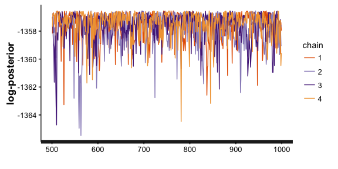

Similarly, those for our parameters of interest look good:

``` r
rstan::traceplot(recover_simulated2, c('alpha','mu'), ncol = 1)
```

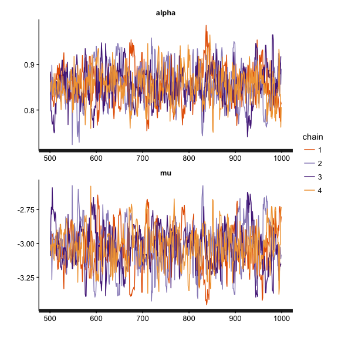

##### Launch shiny-stan

We could also launch [shinystan](http://github.com/stan-dev/shinystan) to check for divergent transitions or excessive autocorrelation in the chains. This is particularly helpful when diagnosing convergence issues.

``` r
if (interactive())
    shinystan::launch_shinystan(recover_simulated2)
```

### Reviewing posterior distributions of parameters

Next, we can check to see whether the model was able to recover our parameters.

#### extracting parameters from the Stanfit object

We use the `rstan::extract()` function to extract parameters from the stanfit object.

E.g. to extract `alpha` & `mu`:

``` r
pp_alpha <- rstan::extract(recover_simulated2,'alpha')$alpha
pp_mu <- rstan::extract(recover_simulated2,'mu')$mu
```

Each of these is a 1xD vector of values, where D = the number of posterior (post-warmup) draws.

In this case, we have 2000: 4 chains \* 1000 iterations / 2

For example, we can plot the posterior distribution of `alpha`, in context of `test_alpha`:

``` r
ggplot(data.frame(alpha = pp_alpha, mu = pp_mu)) + 
    geom_density(aes(x = alpha)) + 
    geom_vline(aes(xintercept = test_alpha), colour = 'red') +
    ggtitle('Posterior distribution of alpha\nshowing true value in red')
```

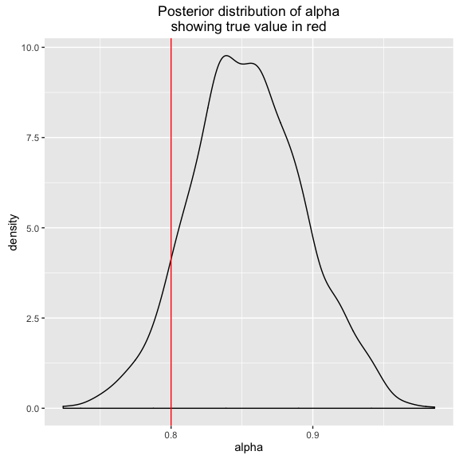

and, repeat the same for `mu`:

``` r
ggplot(data.frame(alpha = pp_alpha, mu = pp_mu)) + 
    geom_density(aes(x = mu)) + 
    geom_vline(aes(xintercept = test_mu), colour = 'red') +
    ggtitle('Posterior distribution of mu\nshowing true value in red')
```

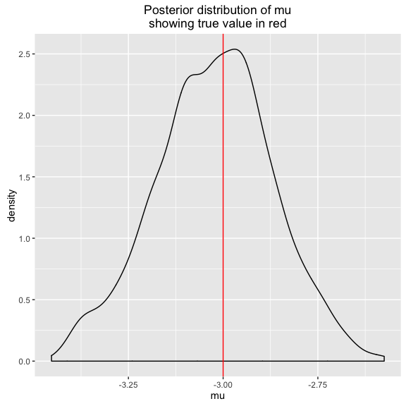

The posterior estimates of the parameters *do* contain those used to simulate our data, but they are not necessarily at the mode of each distribution.

Also, we have a high degree of correlation between `mu` and `alpha`:

``` r
ggplot(data.frame(alpha = pp_alpha, mu = pp_mu)) + 
    geom_density2d(aes(x = alpha, y = mu)) +
    geom_point(aes(x = test_alpha, y = test_mu), colour = 'red', size = 2) +
    ggtitle('Posterior distributions of mu and alpha\nshowing true parameter values in red')
```

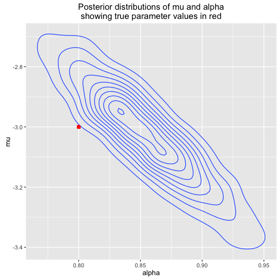

It does seem like these values are on the edge of the posterior density for the parameter values.

*How likely are the parameter values used to simulate our data, according to this model?*

One nice thing about sampling from the full posterior is that we can compute posterior probabilities directly, by summarizing over the values.

To compute the probability of seeing a value of :

``` r
mean(pp_alpha >= test_alpha)
```

    ## [1] 0.919

And for `mu` (testing :

``` r
mean(pp_mu >= test_mu)
```

    ## [1] 0.453

The joint probability of seeing this combination of parameter values, however, isn't as encouraging:

``` r
mean(pp_mu >= test_mu & pp_alpha >= test_alpha)
```

    ## [1] 0.372

We would need more iterations in order to estimate this with greater precision.

### Posterior predictive checks

Next we might ask whether this error in recovering the parameters used to simulate data are substantive. Perhaps we can be a little off in estimating the baseline hazard parameters, so long as our inferences about biomarkers are sustained?

To do this, we will simulate data from our posterior draws of parameters. These are called the **posterior predicted values**. Their distribution is the **posterior predictive distribution**.

*(It may seem crazy to do this for simulated data, but it's not really extra work since we will likely want to re-use this process on our observed dataset. We will take care throughout to write each step as a function to be re-used later.)*

#### simulating data for each posterior draw

We can use hadley's `purrr::map2` to simulate data for each pair of `mu`\*`alpha` values.

``` r
pp_newdata <- 
    purrr::map2(.x = pp_alpha,
                .y = pp_mu,
                .f = ~ weibull_sim_data(alpha = .x, 
                                mu = .y,
                                n = test_n
                                )
                )
```

If you're not familiar with `purrr`, I recommend you inspect the resulting object.

We now have a list of D datasets, each containing a simulation according to that draw's parameter values for `mu` & `alpha`.

Let's plot the time to event in the posterior draws, and compare this to the test dataset we used to fit our model.

``` r
ggplot(pp_newdata %>%
           dplyr::bind_rows() %>%
           dplyr::mutate(type = 'posterior predicted values') %>%
           bind_rows(simulated_data %>% dplyr::mutate(type = 'actual data'))
       , aes(x = os_months, group = os_status, colour = os_status, fill = os_status)) +
    geom_density(alpha = 0.5) +
    facet_wrap(~type, ncol = 1)
```

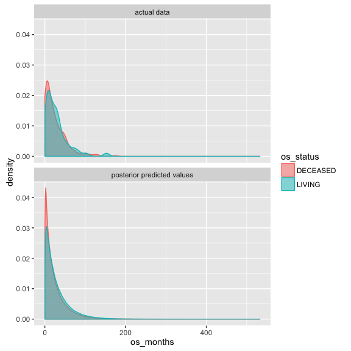

These look pretty similar.

#### summarizing posterior predictive draws

Next we might ask about the posterior estimates of the survival curve. How would we estimate this?

One way (there may be several) is to:

1.  compute the cumulative survival at each observed timepoint for each draw from the posterior
2.  aggregate the cumulative survival estimates to discrete units of time
3.  summarize the cumulative survival for each interval, over the posterior draws.

This is the method we will use here.

``` r
## cumulative survival rate for each posterior draw
pp_survdata <-
    pp_newdata %>%
    purrr::map(~ dplyr::mutate(., os_deceased = os_status == 'DECEASED')) %>%
    purrr::map(~ survival::survfit(Surv(os_months, os_deceased) ~ 1, data = .)) %>%
    purrr::map(fortify)

## summarize cum survival for each unit time (month), summarized at 95% confidence interval
pp_survdata_agg <- 
    pp_survdata %>%
    purrr::map(~ dplyr::mutate(., time_group = floor(time))) %>%
    dplyr::bind_rows() %>%
    dplyr::group_by(time_group) %>%
    dplyr::summarize(surv_mean = mean(surv)
                     , surv_p50 = median(surv)
                     , surv_lower = quantile(surv, probs = 0.025)
                     , surv_upper = quantile(surv, probs = 0.975)
                     ) %>%
    dplyr::ungroup()
```

Finally, we overlay the posterior predictive simulations of the survival curve with that from our original test dataset.

``` r
## km-curve for test data 
test_data_kmcurve <- 
    fortify(
        survival::survfit(
            Surv(os_months, os_deceased) ~ 1, 
            data = simulated_data %>% 
                dplyr::mutate(os_deceased = os_status == 'DECEASED')
            )) %>%
    dplyr::mutate(lower = surv, upper = surv)

ggplot(pp_survdata_agg %>%
           dplyr::mutate(type = 'posterior predicted values') %>%
           dplyr::rename(surv = surv_p50, lower = surv_lower, upper = surv_upper, time = time_group) %>%
           bind_rows(test_data_kmcurve %>% dplyr::mutate(type = 'actual data')),
       aes(x = time, group = type, linetype = type)) + 
    geom_line(aes(y = surv, colour = type)) +
    geom_ribbon(aes(ymin = lower, ymax = upper), alpha = 0.2) +
    xlim(c(0, 200))
```


Here we see that the survival curve from our original (simulated) data matches the posterior predictive density pretty closely. This is a good thing since we are working with simulated data!

#### Saving as a function

As before, we will want to wrap this in a function so that it can be reused in future steps, e.g. when we work with our TCGA data.

``` r
pp_predict_surv <- function(pp_alpha, pp_mu, n,
                            level = 0.9,
                            plot = F, data = NULL,
                            sim_data_fun = weibull_sim_data
                            ) {
    pp_newdata <- 
        purrr::map2(.x = pp_alpha,
                    .y = pp_mu,
                    .f = ~ sim_data_fun(alpha = .x, mu = .y, n = n)
                    )
    
    pp_survdata <-
        pp_newdata %>%
        purrr::map(~ dplyr::mutate(., os_deceased = os_status == 'DECEASED')) %>%
        purrr::map(~ survival::survfit(Surv(os_months, os_deceased) ~ 1, data = .)) %>%
        purrr::map(fortify)
    
    ## compute quantiles given level 
    lower_p <- 0 + ((1 - level)/2)
    upper_p <- 1 - ((1 - level)/2)
    
    pp_survdata_agg <- 
        pp_survdata %>%
        purrr::map(~ dplyr::mutate(.,
                                   time_group = floor(time))) %>%
        dplyr::bind_rows() %>%
        dplyr::group_by(time_group) %>%
        dplyr::summarize(surv_mean = mean(surv)
                         , surv_p50 = median(surv)
                         , surv_lower = quantile(surv,
                                                 probs = lower_p)
                         , surv_upper = quantile(surv,
                                                 probs = upper_p)
                         ) %>%
        dplyr::ungroup()
    
    if (plot == FALSE) {
        return(pp_survdata_agg)
    } 
    
    ggplot_data <- pp_survdata_agg %>%
           dplyr::mutate(type = 'posterior predicted values') %>%
           dplyr::rename(surv = surv_p50,
                         lower = surv_lower,
                         upper = surv_upper, time = time_group)
    
    if (!is.null(data))
        ggplot_data <- 
            ggplot_data %>% 
            bind_rows(
                fortify(
                    survival::survfit(
                        Surv(os_months, os_deceased) ~ 1, 
                        data = data %>% 
                            dplyr::mutate(
                                os_deceased = os_status == 'DECEASED')
                        )) %>%
                dplyr::mutate(lower = surv,
                              upper = surv, type = 'actual data')
                )
    
    pl <- ggplot(ggplot_data,
                 aes(x = time, group = type, linetype = type)) + 
        geom_line(aes(y = surv, colour = type)) +
        geom_ribbon(aes(ymin = lower, ymax = upper), alpha = 0.2)
        
    pl 
}
```

Fitting our model to TCGA data
------------------------------

We are now ready to fit our model to the TCGA data. Here, we can reuse the several functions we defined in earlier steps.

``` r
wei_fit <- rstan::stan(file = stan_file,
                       data = gen_stan_data(clin_data),
                       iter = 1000,
                       chains = 4,
                       init = gen_inits
                       )
print(wei_fit)
```

    ## Inference for Stan model: weibull_survival_null_model.
    ## 4 chains, each with iter=1000; warmup=500; thin=1; 
    ## post-warmup draws per chain=500, total post-warmup draws=2000.
    ## 
    ##              mean se_mean   sd    2.5%     25%     50%     75%   97.5%
    ## alpha_raw   -0.01    0.00 0.01   -0.02   -0.01   -0.01   -0.01    0.00
    ## mu          -3.77    0.01 0.19   -4.13   -3.90   -3.76   -3.64   -3.39
    ## alpha        0.90    0.00 0.05    0.81    0.87    0.90    0.94    1.00
    ## lp__      -915.68    0.04 0.97 -918.17 -916.10 -915.36 -914.97 -914.72
    ##           n_eff Rhat
    ## alpha_raw   456 1.01
    ## mu          445 1.01
    ## alpha       461 1.01
    ## lp__        718 1.01
    ## 
    ## Samples were drawn using NUTS(diag_e) at Sat Jun 25 15:07:44 2016.
    ## For each parameter, n_eff is a crude measure of effective sample size,
    ## and Rhat is the potential scale reduction factor on split chains (at 
    ## convergence, Rhat=1).
    ##  The estimated Bayesian Fraction of Missing Information is a measure of
    ##  the efficiency of the sampler with values close to 1 being ideal.
    ##  For each chain, these estimates are
    ##  1.1 1 1 1.2

Checking convergence
--------------------

In the previous section, we reviewed various ways to check convergence.

### Inspect traceplots

We then also look at the traceplot of the log-posterior. I usually check this first since it gives me a sense of the overall model fit.

``` r
rstan::traceplot(wei_fit, c('lp__'), ncol = 1)
```

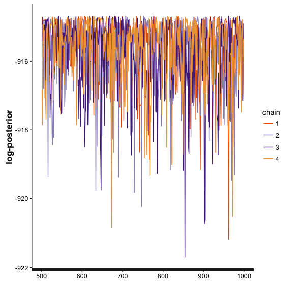

And, for key parameters (in this case, `alpha` & `mu`)

``` r
rstan::traceplot(wei_fit, c('alpha','mu'), ncol = 1)
```

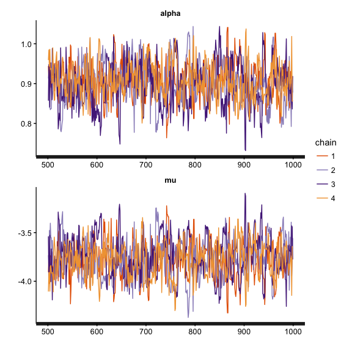

### Launch shinystan

For more detailed model inspection we can leverage the awesome `shinystan`. This displays best-practice diagnostics (e.g. autocorrelation of chains) in an easy-to-use interface.

``` r
if (interactive())
    launch_shinystan(wei_fit)
```

Posterior predictive checks
---------------------------

And, we run our posterior predictive checks using the function we defined earlier:

``` r
pl <- pp_predict_surv(pp_alpha = extract(wei_fit,'alpha')$alpha,
                pp_mu = extract(wei_fit,'mu')$mu,
                n = nrow(clin_data),
                data = clin_data,
                plot = T
                ) 
pl + 
    xlim(NA, 150) +
    ggtitle('Posterior predictive checks for NULL weibull model\nfit to TCGA data; showing 90% CI')
```

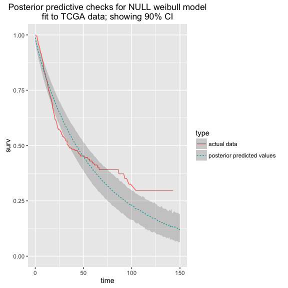

This is a pretty close fit to our data, although it's hard to say just how close of a fit it is.

*For what proportion of timepoints is the observed event rate within the 90% CI of the posterior predicted values?*

``` r
## summarize 90% CI of predicted event rate for each interval
pp_agg <- pp_predict_surv(pp_alpha = extract(wei_fit,'alpha')$alpha,
                pp_mu = extract(wei_fit,'mu')$mu,
                n = nrow(clin_data)
                )


## summarize observed data into same time_groups
act_agg <- 
    survival::survfit(Surv(os_months, I(os_status == 'DECEASED')) ~ 1,
                             data = clin_data
                             ) %>%
    fortify() %>%
    dplyr::mutate(time_group = floor(time)) %>%
    dplyr::group_by(time_group) %>%
    dplyr::summarise(observed_surv = mean(surv)) %>%
    dplyr::ungroup()

## compute proportion of observed values within 90% ci
act_agg %>%
    dplyr::inner_join(pp_agg, by = 'time_group') %>%
    dplyr::mutate(within_interval = ifelse(observed_surv >= surv_lower & observed_surv <= surv_upper,
                                           1, 0),
                  time_set = cut(time_group, breaks = c(0, 100))
                  ) %>%
    dplyr::group_by(time_set) %>%
    dplyr::summarize(mean(within_interval))
```

    ## Source: local data frame [2 x 2]
    ## 
    ##   time_set mean(within_interval)
    ##     <fctr>                 <dbl>
    ## 1  (0,100]             0.5769231
    ## 2       NA             0.0000000

This isn't particularly encouraging, since it suggests that far fewer than the expected 90% of observations fall within the posterior intervals.

But, we haven't included any covariate values. Does this improve with additional covariates?
