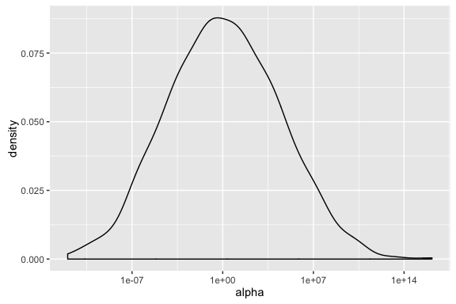
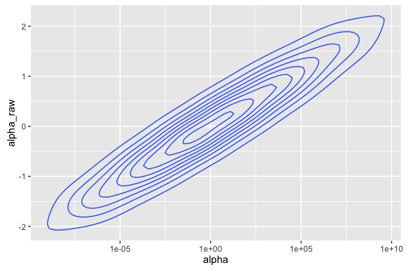
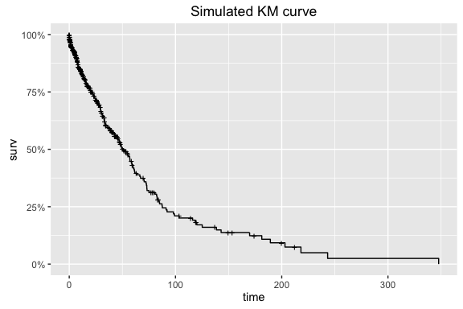
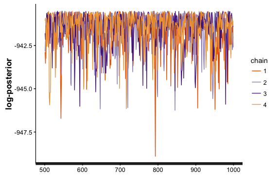
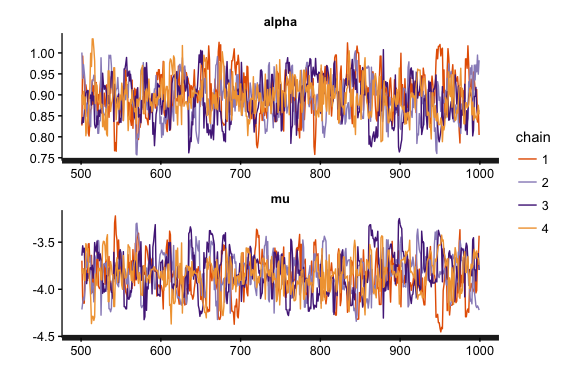
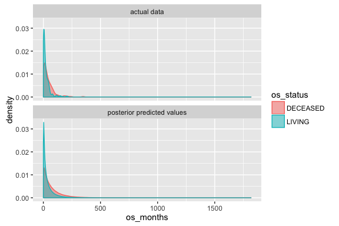
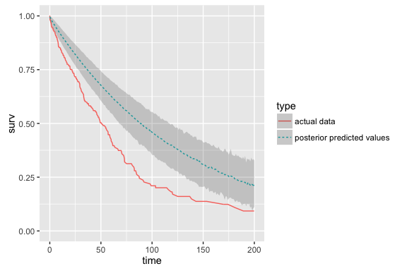
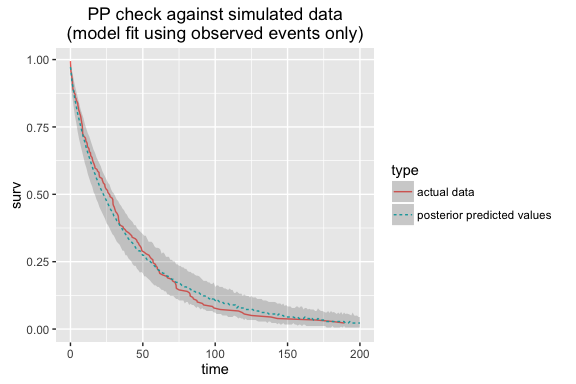
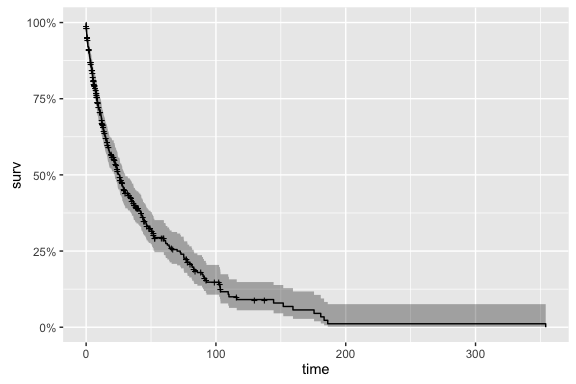
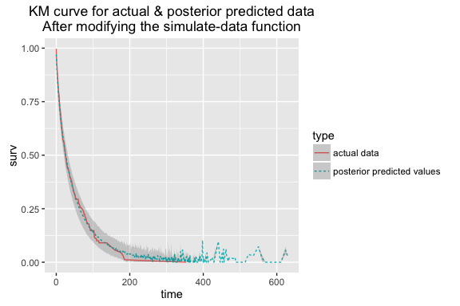

Model checking with simulated data (survival model example)
================
Jacqueline Buros
2016-07-28

First analysis: parametric survival model
=========================================

For our first analysis we will work with a parametric Weibull survival model.

We will start with model code adapted from [wei\_bg.stan](https://github.com/to-mi/stan-survival-shrinkage/blob/master/wei_bg.stan) within the [github repo]('http://github.com/to-mi/stan-survival-shrinkage') accompanying [Peltola et al, 2014](http://ceur-ws.org/Vol-1218/bmaw2014_paper_8.pdf)'s nice paper describing a bayesian approach to biomarker evaluation.

This model assumes that the time to event `x` follows a Weibull distribution.

Stan parameterizes this probability density function as :

$$f(x|\\alpha,\\sigma) = 
\\frac{\\alpha}{\\sigma}\\left(\\frac{x}{\\sigma}\\right)^{\\alpha-1}e^{-(x/\\sigma)^{\\alpha}}$$

In the context of this analysis, we will define two parameters:

-   `alpha` (shape) defined as above
-   `mu` (scale) where $\\sigma = e^\\frac{-\\mu}{\\alpha}$.

If we had covariates and wanted to estimate a proportional hazards model, we would replace `mu` with a linear combination of covariates. However, in this case we are interested in recovering features of our NULL model and so we treat `mu` as a constant intercept.

Stan code for the model
-----------------------

The stan code we will be using is provided in this [biostan package](http://github.com/jburos/biostan).

It can be accessed via `system.file`, as :

``` r
if (!require(biostan))
    devtools::install_github('jburos/biostan')
library(biostan)
stan_file <- system.file('stan', 'weibull_survival_null_model.stan', package =  'biostan')
```

Here are the contents of this file:

``` r
biostan::print_stan_file(stan_file)
```

    ## /*  Variable naming: 
    ##  obs       = observed 
    ##  cen       = (right) censored 
    ##  N         = number of samples 
    ##  tau       = scale parameter 
    ## */ 
    ## data { 
    ##   int<lower=0> Nobs; 
    ##   int<lower=0> Ncen; 
    ##   vector[Nobs] yobs; 
    ##   vector[Ncen] ycen; 
    ## } 
    ##  
    ## transformed data { 
    ##   real<lower=0> tau_mu; 
    ##   real<lower=0> tau_al; 
    ##  
    ##   tau_mu = 10.0; 
    ##   tau_al = 10.0; 
    ## } 
    ##  
    ## parameters { 
    ##   real alpha_raw; 
    ##   real mu; 
    ## } 
    ##  
    ## transformed parameters { 
    ##   real alpha; 
    ##   alpha = exp(tau_al * alpha_raw); 
    ## } 
    ##  
    ## model { 
    ##   yobs ~ weibull(alpha, exp(-(mu)/alpha)); 
    ##   target += weibull_lccdf(ycen | alpha, exp(-(mu)/alpha)); 
    ##  
    ##   alpha_raw ~ normal(0.0, 1.0); 
    ##   mu ~ normal(0.0, tau_mu); 
    ## } 
    ## 

### The model in detail

Before using this model for analysis, we want to first review the model code in detail & test it against some simulated data.

This will ensure that (a) we understand the model well, and (b) the model can recover estimates from simulated data.

*( As you will see, several parts of the simulate-data process can also be re-used for posterior predictive checking. So we will save components of the process to be reused in later steps. )*

If you're at an R console, you can open the Stan file in an editor as follows:

``` r
if (interactive())
    file.edit(stan_file)
```

#### Review data block

Let's review the data block first.

This will tell us the structure and format of data input to the model.

``` r
print_stan_file(stan_file, section = 'data')
```

    ## data { 
    ##   int<lower=0> Nobs; 
    ##   int<lower=0> Ncen; 
    ##   vector[Nobs] yobs; 
    ##   vector[Ncen] ycen; 
    ## }

The censored & observed data points are provided as separate input vectors.

*observed data points*

-   `Nobs`: number of observed data points
-   `yobs`: times to observed events

*censored data points*

-   `Ncen`: number of censored data points
-   `ycen`: times to censored events

Recall that this is a NULL model (with no covariate values), so the number & values of observed covariates are not needed.

#### Review model block

The stan code contains an implicit constant term, in the linear predictor `mu`.

``` r
print_stan_file(stan_file, section = 'model')
```

    ## model { 
    ##   yobs ~ weibull(alpha, exp(-(mu)/alpha)); 
    ##   target += weibull_lccdf(ycen | alpha, exp(-(mu)/alpha)); 
    ##  
    ##   alpha_raw ~ normal(0.0, 1.0); 
    ##   mu ~ normal(0.0, tau_mu); 
    ## }

Observe how the ccdf (complementary cumulative distribution function) is used to compute the log probability of the censored observations.

*What does the ccdf represent in this scenario?*

*How does the model address the censoring process?*

#### Review parameters block

Our stan code also contains a reparameterization of the `alpha` term, in the `transformed parameters` block.

Observe:

``` r
print_stan_file(stan_file, section = 'transformed parameters')
```

    ## transformed parameters { 
    ##   real alpha; 
    ##   alpha = exp(tau_al * alpha_raw); 
    ## }

(recall that `tau_al` is a constant scaling term set to 10, and `alpha_raw` is a parameter with a normal(0, 1) prior distribution).

This reparameterization achieves two things :

1.  The use of `tau_al * alpha_raw` is an example of a **non-centered parameterization**.
    -   It would have been *mathematically* equivalent to define a (non-transformed) parameter `alpha` with a prior `normal(0, 10)`.
    -   However, this parameterization yields a parameter (`alpha_raw`) which is on a similar scale as other parameters in our model. The `exp()` transformation makes the difference between these two scales even more dramatic.
    -   In general, having all parameters on a similar scale makes the sampling more efficient.

2.  The `exp()` transformation of this parameter additionally allows us to put a prior on `log alpha`.
    -   we want to put a prior on `log alpha` since alpha enters into our likelihood in the exponent.

This seems like a lot of gymnastics to be doing.

However, it has practical implications for our modeling efficiency.

Observe that, for a single value of `alpha_raw` (e.g. 0.2), the transformation yields:

``` r
alpha_raw <- 0.2
tau_al <- 10
log_alpha <- alpha_raw * tau_al
alpha <- exp(log_alpha)
print(alpha)
```

    ## [1] 7.389056

which may seem silly.

**However**

Consider the resulting distribution of alpha over a range of values for `alpha_raw` sampled from our `normal(0, 1)` prior:

``` r
alpha_raw <- rnorm(1000, 0, 1)
tau_al <- 10
log_alpha <- alpha_raw * tau_al
alpha <- exp(log_alpha)
ggplot(data.frame(alpha = alpha, alpha_raw = alpha_raw), 
       aes(x = alpha)) + 
    geom_density() + 
    scale_x_log10(labels = scientific)
```



Notice how `alpha` ranges from 1e-10 to 1e+10 on a log scale. We have to truncate this dramatically to even consider plotting it on its original scale.

Sampling this parameter space may require different step sizes & different tuning parameter values throughout this distribution.

The `alpha_raw` scale, by comparison, is a lot friendlier.

``` r
ggplot(data.frame(alpha = alpha, alpha_raw = alpha_raw), 
       aes(x = alpha, y = alpha_raw)) + 
    geom_density2d() + 
    scale_x_log10(labels = scientific)
```



This distribution is centered at 0 and has more consistent behavior throughout its range of values.

What's important to note here is that while the non-centered parameterization is mathematically equivalent to the standard parameterization, it is (in some ways) a *different model*. You may get different results from each.

Packages like [rstanarm](http://github.com/stan-dev/rstanarm) which provide easy wrappers to a variety of standard models implemented in Stan use a non-centered parameterization by default.

More information on non-centered parameterization:

1.  [discussion on stan-dev list](https://groups.google.com/forum/#!topic/stan-dev/9ZvhKpXlwuI)
2.  [Gelman, 2004. Parameterization and Bayesian Modeling](http://www.stat.columbia.edu/~gelman/research/published/parameterization.pdf)

Testing the model on simulated data
-----------------------------------

Now that we have reviewed the model code, we are ready to simulate data according to this model.

We can simulate data using R or in Stan. We will start by simulating data in R.

### Simulate data in R

Like our stan model code, this function adapts the [example.R](https://github.com/to-mi/stan-survival-shrinkage/blob/master/example.R) code from the [stan-survival-shrinkage github repo](https://github.com/to-mi/stan-survival-shrinkage).

Here we write a function that takes our two parameters (`alpha` and `mu`) as inputs and the desired number of observed & censored observations. It returns a data frame of simulated event times.

``` r
sim_data <- function(alpha, mu, Nobs, Ncen) {
    observed_data <- data.frame(os_status = rep_len('DECEASED', Nobs),
                                os_months = rweibull(n = Nobs, alpha, exp(-(mu)/alpha)),
                                stringsAsFactors = F
                                )
    
    censored_data <- data.frame(os_status = rep_len('LIVING', Ncen),
                                os_months = runif(Ncen) * rweibull(Ncen, alpha, exp(-(mu)/alpha)),
                                stringsAsFactors = F
                                )
    
    return(observed_data %>% bind_rows(censored_data))
}
```

A few comments about this function:

1.  Notice how the censoring process is `runif()`. In general, our Stan model is ignorant of the censoring process except to assume that censoring is noninformative.
2.  We have also deliberately written this function to mirror the structure of our bladder-cancer data.

This will make it easier to reuse this function later.

#### Simulate data for arbitrary input values

We can use this to simulate a dataset for hypothetical parameter values of `alpha` & `mu`.

``` r
test_alpha <- 0.8
test_mu <- -3

## sample sizes from TCGA blca data
test_nobs <- 179 
test_ncen <- 230

## test these inputs for arbitrary values of alpha & mu
simulated_data <- 
    sim_data(alpha = test_alpha,
                 mu = test_mu,
                 Nobs = test_nobs,
                 Ncen = test_ncen
                 ) 
head(simulated_data)
```

    ##   os_status  os_months
    ## 1  DECEASED  8.1479419
    ## 2  DECEASED  5.8837394
    ## 3  DECEASED 55.6769037
    ## 4  DECEASED  0.2185749
    ## 5  DECEASED 29.4106080
    ## 6  DECEASED 21.7830160

Which yields the following survival curve:

``` r
## plot KM curve from simulated data
simulated_data <- 
    simulated_data %>%
    dplyr::mutate(os_deceased = os_status == 'DECEASED')

autoplot(survival::survfit(Surv(os_months, os_deceased) ~ 1,
                      data = simulated_data
                      ), conf.int = F) + 
    ggtitle('Simulated KM curve')
```



### fit to simulated data in stan

Now that we have simulated data, we are ready to fit the model in Stan.

If we have written both our stan code & simulated data process correctly, our posterior intervals for `alpha` and `mu` should contain the values used to simulate our dataset (0.8 and -3).

#### preparing data for stan

Stan takes data input as a list. The contents of the list should match those of the `data` block in the stan code.

E.g. looking at the data block -

``` r
print_stan_file(stan_file, section = 'data')
```

    ## data { 
    ##   int<lower=0> Nobs; 
    ##   int<lower=0> Ncen; 
    ##   vector[Nobs] yobs; 
    ##   vector[Ncen] ycen; 
    ## }

our input list to Stan should contain dimensions & values for observed & censored data, separately.

``` r
observed_data <- simulated_data %>%
    dplyr::filter(os_status == 'DECEASED')

censored_data <- simulated_data %>%
    dplyr::filter(os_status != 'DECEASED')

stan_data <- list(
    Nobs = nrow(observed_data),
    Ncen = nrow(censored_data),
    yobs = observed_data$os_months,
    ycen = censored_data$os_months
)
rm(censored_data)
rm(observed_data)
str(stan_data)
```

    ## List of 4
    ##  $ Nobs: int 179
    ##  $ Ncen: int 230
    ##  $ yobs: num [1:179] 8.148 5.884 55.677 0.219 29.411 ...
    ##  $ ycen: num [1:230] 3.904 0.537 136.908 5.707 1.804 ...

(wrap this prep-data process in a function `gen_stan_data` for later)

``` r
gen_stan_data <- function(data) {
    observed_data <- data %>%
        dplyr::filter(os_status == 'DECEASED')
    
    censored_data <- data %>%
        dplyr::filter(os_status != 'DECEASED')
    
    stan_data <- list(
        Nobs = nrow(observed_data),
        Ncen = nrow(censored_data),
        yobs = observed_data$os_months,
        ycen = censored_data$os_months
    )
}
```

#### test simulated values with stan

Let's call `stan`:

``` r
recover_simulated <- 
    rstan::stan(stan_file,
                data = stan_data,
                chains = 4,
                iter = 1000,
                seed = 1328025050
                )
print(recover_simulated)
```

    ## Inference for Stan model: weibull_survival_null_model.
    ## 4 chains, each with iter=1000; warmup=500; thin=1; 
    ## post-warmup draws per chain=500, total post-warmup draws=2000.
    ## 
    ##                    mean      se_mean          sd          2.5%
    ## alpha_raw  6.000000e-02 9.000000e-02 1.30000e-01 -2.000000e-02
    ## mu        -3.110000e+00 9.000000e-01 1.29000e+00 -4.210000e+00
    ## alpha      5.360000e+00 5.470000e+00 7.74000e+00  8.100000e-01
    ## lp__      -6.610954e+46 7.377575e+46 1.74155e+47 -9.113326e+47
    ##                     25%     50%     75%   97.5% n_eff   Rhat
    ## alpha_raw -1.000000e-02   -0.01    0.07    0.29     2  30.33
    ## mu        -3.930000e+00   -3.73   -2.70   -0.89     2   7.70
    ## alpha      8.700000e-01    0.91    5.43   19.03     2 130.95
    ## lp__      -3.000799e+46 -941.61 -940.97 -940.56     6   1.61
    ## 
    ## Samples were drawn using NUTS(diag_e) at Thu Jul 28 13:18:17 2016.
    ## For each parameter, n_eff is a crude measure of effective sample size,
    ## and Rhat is the potential scale reduction factor on split chains (at 
    ## convergence, Rhat=1).
    ##  The estimated Bayesian Fraction of Missing Information is a measure of
    ##  the efficiency of the sampler with values close to 1 being ideal.
    ##  For each chain, these estimates are
    ##  1.1 1.1 0 1.1

What's wrong with this picture?

(A: poor convergence) (A: in some chains, we see a lot of numerical problems.)

#### Setting initial values

This step is usually optional, but may be necessary for some models.

In this case, it may be useful to set initial values. Recall the projected range of our transformed parameter `alpha`?

By default, Stan chooses a random initial value for each parameter on the unconstrained scale between -2 and 2. This random initialization is on the *unconstrained support* for each parameter. This guarantees that initial values are consistent with the constrained range.

When we pass the initial values in, however, these are on the *constrained scale*. See the [Stan manual](http://mc-stan.org/documentation/) for more details about transformations applied to constrained variables.

##### gen\_inits function

Let's review the parameters block for this model again.

``` r
print_stan_file(stan_file, section = 'parameters')
```

    ## parameters { 
    ##   real alpha_raw; 
    ##   real mu; 
    ## }

We have two parameters for which initial values should be set.

Let's try modifying the initial range for `alpha_raw` to utilize a smaller range than the default.

``` r
gen_inits <- function() {
      list(
        alpha_raw = 0.01*rnorm(1),
        mu = rnorm(1)
      )
}
```

We wrap this in a function so that each chain will have a different set of initial values.

#### stan code with initial values

Let's try fitting our stan model again with our initial values function.

``` r
recover_simulated2 <- 
    rstan::stan(stan_file,
                data = stan_data,
                chains = 4,
                iter = 1000,
                init = gen_inits
                )
print(recover_simulated2)
```

    ## Inference for Stan model: weibull_survival_null_model.
    ## 4 chains, each with iter=1000; warmup=500; thin=1; 
    ## post-warmup draws per chain=500, total post-warmup draws=2000.
    ## 
    ##              mean se_mean   sd    2.5%     25%     50%     75%   97.5%
    ## alpha_raw   -0.01    0.00 0.01   -0.02   -0.02   -0.01   -0.01    0.00
    ## mu          -3.84    0.01 0.21   -4.25   -3.98   -3.84   -3.70   -3.43
    ## alpha        0.89    0.00 0.05    0.80    0.86    0.89    0.93    0.99
    ## lp__      -941.58    0.03 1.01 -944.39 -942.02 -941.28 -940.83 -940.54
    ##           n_eff Rhat
    ## alpha_raw   426 1.01
    ## mu          417 1.01
    ## alpha       427 1.01
    ## lp__        913 1.00
    ## 
    ## Samples were drawn using NUTS(diag_e) at Thu Jul 28 13:18:30 2016.
    ## For each parameter, n_eff is a crude measure of effective sample size,
    ## and Rhat is the potential scale reduction factor on split chains (at 
    ## convergence, Rhat=1).
    ##  The estimated Bayesian Fraction of Missing Information is a measure of
    ##  the efficiency of the sampler with values close to 1 being ideal.
    ##  For each chain, these estimates are
    ##  0.9 1.1 0.9 1

Now we see fewer numerical problems, and better R-hat values.

#### checking convergence

Normally I would dig further into this model to check convergence, since R-hat alone isn't sufficient to determine convergence.

But in this case I'm distracted by the summary of posterior estimates for our parameter values.

*Have we recovered our parameter values?*

The values we used to simulate our data do not fall into the 95% credible intervals from our model.

I will do some quick checks on convergence to see if this might be explained by lack of convergence.

##### Reviewing traceplots

Reviewing traceplot of `lp__` (log-posterior), which can reflect overall model fit:

``` r
rstan::traceplot(recover_simulated2, 'lp__')
```



And, reviewing traceplot of key parameters of interest:

``` r
rstan::traceplot(recover_simulated2, c('alpha','mu'), ncol = 1)
```



Both of these look fuzzy-caterpillar-like.

##### Launch shiny-stan

You might then also launch [shinystan](http://github.com/stan-dev/shinystan) to see if this can help diagnose any convergence problems.

``` r
if (interactive())
    shinystan::launch_shinystan(recover_simulated2)
```

But, in general, it doesn't seem like lack of convergence can explain the difference between estimated parameter values & those used to simulate our data.

#### thinking about censoring

What if we were to limit our input data to observed events?

``` r
recover_simulated_obs <- 
    rstan::stan(stan_file,
                data = gen_stan_data(
                    simulated_data %>% dplyr::filter(os_status == 'DECEASED')
                    ),
                chains = 4,
                iter = 1000,
                init = gen_inits
                )
print(recover_simulated_obs)
```

    ## Inference for Stan model: weibull_survival_null_model.
    ## 4 chains, each with iter=1000; warmup=500; thin=1; 
    ## post-warmup draws per chain=500, total post-warmup draws=2000.
    ## 
    ##              mean se_mean   sd    2.5%     25%     50%     75%   97.5%
    ## alpha_raw   -0.02    0.00 0.01   -0.03   -0.03   -0.02   -0.02   -0.01
    ## mu          -2.91    0.01 0.21   -3.31   -3.05   -2.90   -2.75   -2.52
    ## alpha        0.81    0.00 0.05    0.71    0.77    0.80    0.84    0.90
    ## lp__      -838.92    0.04 1.08 -841.79 -839.37 -838.59 -838.14 -837.82
    ##           n_eff Rhat
    ## alpha_raw   420    1
    ## mu          414    1
    ## alpha       420    1
    ## lp__        768    1
    ## 
    ## Samples were drawn using NUTS(diag_e) at Thu Jul 28 13:18:44 2016.
    ## For each parameter, n_eff is a crude measure of effective sample size,
    ## and Rhat is the potential scale reduction factor on split chains (at 
    ## convergence, Rhat=1).
    ##  The estimated Bayesian Fraction of Missing Information is a measure of
    ##  the efficiency of the sampler with values close to 1 being ideal.
    ##  For each chain, these estimates are
    ##  0.8 1 1.1 0.9

And, to our censored observations?

``` r
recover_simulated_cen <- 
    rstan::stan(stan_file,
                data = gen_stan_data(
                    simulated_data %>% dplyr::filter(os_status != 'DECEASED')
                    ),
                chains = 4,
                iter = 1000,
                init = gen_inits
                )
print(recover_simulated_cen)
```

    ## Inference for Stan model: weibull_survival_null_model.
    ## 4 chains, each with iter=1000; warmup=500; thin=1; 
    ## post-warmup draws per chain=500, total post-warmup draws=2000.
    ## 
    ##             mean se_mean   sd   2.5%    25%    50%   75% 97.5% n_eff Rhat
    ## alpha_raw  -0.18    0.01 0.14  -0.42  -0.30  -0.18 -0.06  0.07   209 1.01
    ## mu        -12.59    0.29 4.91 -25.18 -15.37 -11.65 -9.06 -5.78   285 1.01
    ## alpha       0.41    0.03 0.55   0.01   0.05   0.17  0.55  1.99   298 1.02
    ## lp__       -1.08    0.04 0.73  -3.19  -1.32  -0.82 -0.58 -0.45   283 1.02
    ## 
    ## Samples were drawn using NUTS(diag_e) at Thu Jul 28 13:18:57 2016.
    ## For each parameter, n_eff is a crude measure of effective sample size,
    ## and Rhat is the potential scale reduction factor on split chains (at 
    ## convergence, Rhat=1).
    ##  The estimated Bayesian Fraction of Missing Information is a measure of
    ##  the efficiency of the sampler with values close to 1 being ideal.
    ##  For each chain, these estimates are
    ##  1.7 1 1.3 1.3

We see that we have (not surprisingly!) very poor inferences from our censored observations -- .. and that we are able to recover our parameter estimates when limiting only to observed data points.

This is our first hint that the inability to recover parameter estimates has something to do with how the data are censored. Is this just introducing error into our inferences?

### Posterior predictive checks

Next we might ask whether this error in recovering the parameters used to simulate data are substantive. Perhaps we can be a little off in estimating the baseline hazard parameters, so long as our inferences about biomarkers are sustained?

To do this, we will simulate data from our posterior draws of parameters. These are called the **posterior predicted values**. Their distribution is the **posterior predictive distribution**.

#### extracting parameters from the Stanfit object

We use the `rstan::extract()` function to extract parameters from the stanfit object.

E.g. to extract `alpha` & `mu`:

``` r
pp_alpha <- rstan::extract(recover_simulated2,'alpha')$alpha
pp_mu <- rstan::extract(recover_simulated2,'mu')$mu
```

Each of these is a 1xD vector of values, where D = the number of posterior (post-warmup) draws.

In this case, we have 2000: 4 chains \* 1000 iterations / 2

#### simulating data for each posterior draw

We can use hadley's `purrr::map2` to simulate data for each pair of `mu`\*`alpha` values.

``` r
pp_newdata <- 
    purrr::map2(.x = pp_alpha,
                .y = pp_mu,
                .f = ~ sim_data(alpha = .x, 
                                mu = .y,
                                Nobs = test_nobs,
                                Ncen = test_ncen
                                )
                )
```

We now have a list of D datasets, each containing a simulation according to that draw's parameter values for `mu` & `alpha`.

Let's plot the time to event in the posterior draws, and compare this to the test dataset we used to fit our model.

``` r
ggplot(pp_newdata %>%
           dplyr::bind_rows() %>%
           dplyr::mutate(type = 'posterior predicted values') %>%
           bind_rows(simulated_data %>% dplyr::mutate(type = 'actual data'))
       , aes(x = os_months, group = os_status, colour = os_status, fill = os_status)) +
    geom_density(alpha = 0.5) +
    facet_wrap(~type, ncol = 1)
```



Pretty similar.

#### summarizing posterior predictive draws

Next we might ask about the posterior estimates of the survival curve. How would we estimate this?

One way (there may be several) is to: 1. compute the cumulative survival at each observed timepoint for each draw from the posterior 2. aggregate the cumulative survival estimates to discrete units of time 3. summarize the cumulative survival for each interval, over the posterior draws.

This is the method we will use here.

``` r
## cumulative survival rate for each posterior draw
pp_survdata <-
    pp_newdata %>%
    purrr::map(~ dplyr::mutate(., os_deceased = os_status == 'DECEASED')) %>%
    purrr::map(~ survival::survfit(Surv(os_months, os_deceased) ~ 1, data = .)) %>%
    purrr::map(fortify)

## summarize cum survival for each unit time (month), summarized at 95% confidence interval
pp_survdata_agg <- 
    pp_survdata %>%
    purrr::map(~ dplyr::mutate(., time_group = floor(time))) %>%
    dplyr::bind_rows() %>%
    dplyr::group_by(time_group) %>%
    dplyr::summarize(surv_mean = mean(surv)
                     , surv_p50 = median(surv)
                     , surv_lower = quantile(surv, probs = 0.025)
                     , surv_upper = quantile(surv, probs = 0.975)
                     ) %>%
    dplyr::ungroup()
```

Finally, we overlay the posterior predictive simulations of the survival curve with that from our original test dataset.

``` r
## km-curve for test data 
test_data_kmcurve <- 
    fortify(
        survival::survfit(
            Surv(os_months, os_deceased) ~ 1, 
            data = simulated_data %>% 
                dplyr::mutate(os_deceased = os_status == 'DECEASED')
            )) %>%
    dplyr::mutate(lower = surv, upper = surv)

ggplot(pp_survdata_agg %>%
           dplyr::mutate(type = 'posterior predicted values') %>%
           dplyr::rename(surv = surv_p50, lower = surv_lower, upper = surv_upper, time = time_group) %>%
           bind_rows(test_data_kmcurve %>% dplyr::mutate(type = 'actual data')),
       aes(x = time, group = type, linetype = type)) + 
    geom_line(aes(y = surv, colour = type)) +
    geom_ribbon(aes(ymin = lower, ymax = upper), alpha = 0.2) +
    xlim(c(0, 200))
```



Here we see a dramatic difference in survival curve, comparing our original simulated data with our posterior predictive distribution.

#### Saving as a function

As before, we will want to wrap this in a function so that it can be reused in future steps, e.g. when we work with our TCGA data.

``` r
pp_predict_surv <- function(pp_alpha, pp_mu, Nobs, Ncen,
                            level = 0.9,
                            plot = F, data = NULL,
                            sim_data_fun = sim_data
                            ) {
    pp_newdata <- 
        purrr::map2(.x = pp_alpha,
                    .y = pp_mu,
                    .f = ~ sim_data_fun(alpha = .x, mu = .y,
                                    Nobs = Nobs, Ncen = Ncen
                                    )
                    )
    
    pp_survdata <-
        pp_newdata %>%
        purrr::map(~ dplyr::mutate(., os_deceased = os_status == 'DECEASED')) %>%
        purrr::map(~ survival::survfit(Surv(os_months, os_deceased) ~ 1, data = .)) %>%
        purrr::map(fortify)
    
    ## compute quantiles given level 
    lower_p <- 0 + ((1 - level)/2)
    upper_p <- 1 - ((1 - level)/2)
    
    pp_survdata_agg <- 
        pp_survdata %>%
        purrr::map(~ dplyr::mutate(.,
                                   time_group = floor(time))) %>%
        dplyr::bind_rows() %>%
        dplyr::group_by(time_group) %>%
        dplyr::summarize(surv_mean = mean(surv)
                         , surv_p50 = median(surv)
                         , surv_lower = quantile(surv,
                                                 probs = lower_p)
                         , surv_upper = quantile(surv,
                                                 probs = upper_p)
                         ) %>%
        dplyr::ungroup()
    
    if (plot == FALSE) {
        return(pp_survdata_agg)
    } 
    
    ggplot_data <- pp_survdata_agg %>%
           dplyr::mutate(type = 'posterior predicted values') %>%
           dplyr::rename(surv = surv_p50,
                         lower = surv_lower,
                         upper = surv_upper, time = time_group)
    
    if (!is.null(data))
        ggplot_data <- 
            ggplot_data %>% 
            bind_rows(
                fortify(
                    survival::survfit(
                        Surv(os_months, os_deceased) ~ 1, 
                        data = data %>% 
                            dplyr::mutate(
                                os_deceased = os_status == 'DECEASED')
                        )) %>%
                dplyr::mutate(lower = surv,
                              upper = surv, type = 'actual data')
                )
    
    pl <- ggplot(ggplot_data,
                 aes(x = time, group = type, linetype = type)) + 
        geom_line(aes(y = surv, colour = type)) +
        geom_ribbon(aes(ymin = lower, ymax = upper), alpha = 0.2)
        
    pl 
}
```

#### PP check on observed-event only model

How well is our actual data to our posterior predicted values when we limit our model to observed events only?

``` r
pp_alpha_obs <- extract(recover_simulated_obs, 'alpha')$alpha
pp_mu_obs <- extract(recover_simulated_obs, 'mu')$mu
pl <- pp_predict_surv(pp_alpha = pp_alpha_obs,
                pp_mu = pp_mu_obs,
                Nobs = test_nobs,
                Ncen = 0,
                plot = T,
                data = simulated_data %>% 
                    dplyr::filter(os_status == 'DECEASED')
                )
pl + 
    ggtitle('PP check against simulated data\n(model fit using observed events only)') +
    xlim(NA, 200)
```



This is an example of how posterior predictive checking can be useful.

At this point we know there must be a problem with either our data simulating process, our model, or both.

My suspicion is that it has something to do with the censoring (`runif()`) process in the data simulation.

checking data simulation
------------------------

Let's try an alternate data simulating process, where the censoring is independent of the survival time.

``` r
alt_sim_data <- function(alpha, mu, Nobs, Ncen) {
    
    data <- data.frame(surv_months = rweibull(n = Nobs + Ncen, alpha, exp(-(mu)/alpha)),
                       censor_months = rexp(n = Nobs + Ncen, rate = 1/100),
                       stringsAsFactors = F
                       ) %>%
        dplyr::mutate(os_status = ifelse(surv_months < censor_months,
                                          'DECEASED', 'LIVING'
                                          ),
                       os_months = ifelse(surv_months < censor_months,
                                          surv_months, censor_months
                                          )
                       )

    return(data)
}
```

Next, we simulate new data according to this function & try to recover parameter estimates using Stan.

``` r
alt_simulated_data <- alt_sim_data(
    alpha = test_alpha,
    mu = test_mu,
    Ncen = test_ncen,
    Nobs = test_nobs
    )
autoplot(survival::survfit(Surv(os_months, I(os_status == 'DECEASED')) ~ 1,
                           data = alt_simulated_data
                           ))
```



How many censored observations are there?

``` r
table(alt_simulated_data$os_status)
```

    ## 
    ## DECEASED   LIVING 
    ##      282      127

Can we recover parameter estimates with our model?

``` r
recover_alt_simulated <- rstan::stan(
    file = stan_file,
    data = gen_stan_data(alt_simulated_data),
    chains = 4,
    iter = 1000,
    init = gen_inits
)
print(recover_alt_simulated)
```

    ## Inference for Stan model: weibull_survival_null_model.
    ## 4 chains, each with iter=1000; warmup=500; thin=1; 
    ## post-warmup draws per chain=500, total post-warmup draws=2000.
    ## 
    ##               mean se_mean   sd     2.5%      25%      50%      75%
    ## alpha_raw    -0.03    0.00 0.00    -0.04    -0.03    -0.03    -0.02
    ## mu           -2.88    0.01 0.16    -3.19    -2.98    -2.88    -2.77
    ## alpha         0.77    0.00 0.04     0.70     0.74     0.77     0.80
    ## lp__      -1325.90    0.06 1.11 -1329.14 -1326.33 -1325.57 -1325.09
    ##              97.5% n_eff Rhat
    ## alpha_raw    -0.02   331 1.01
    ## mu           -2.60   293 1.01
    ## alpha         0.85   317 1.01
    ## lp__      -1324.80   401 1.01
    ## 
    ## Samples were drawn using NUTS(diag_e) at Thu Jul 28 13:19:53 2016.
    ## For each parameter, n_eff is a crude measure of effective sample size,
    ## and Rhat is the potential scale reduction factor on split chains (at 
    ## convergence, Rhat=1).
    ##  The estimated Bayesian Fraction of Missing Information is a measure of
    ##  the efficiency of the sampler with values close to 1 being ideal.
    ##  For each chain, these estimates are
    ##  0.7 1.1 1 1

Run posterior predictive checks on this analysis

``` r
pp_alpha <- rstan::extract(recover_alt_simulated, 'alpha')$alpha
pp_mu <- rstan::extract(recover_alt_simulated, 'mu')$mu
pl <- pp_predict_surv(pp_alpha = pp_alpha,
                pp_mu = pp_mu,
                sim_data_fun = alt_sim_data,
                Nobs = test_nobs, Ncen = test_ncen,
                plot = T, data = alt_simulated_data
                )
pl + ggtitle('KM curve for actual & posterior predicted data\nAfter modifying the simulate-data function')
```



final thoughts
--------------

In sum, we attempted to check our model code against simulated data, but accidentally simulated our data with an informative censoring process.

It was obvious at first that our model was unable to recover the parameter values used to simulate the data, which was troubling at first. But, what is perhaps more useful to observe, the standard workflow of doing posterior predictive checking on our data also indicated that something was awry.

Had these data *not* been simulated, and had they instead come from (say) a clinical study, we would not have known *a priori* that the censoring process was informative. We would also not have known that the posterior estimates of `mu` and `alpha` were incorrect. What is encouraging, however, is that the **posterior predictive check did indicate we had a problem**. It was pretty obvious that posterior predictive distribution did not correspond to our actual data.

Here, since we are working with simulated data, we are able to address the concern by modifying our simulate-data process. In the context of an actual analysis, modifying your data is not a possibility (!) and so the model would instead have to be adjusted to account for the censoring process.
